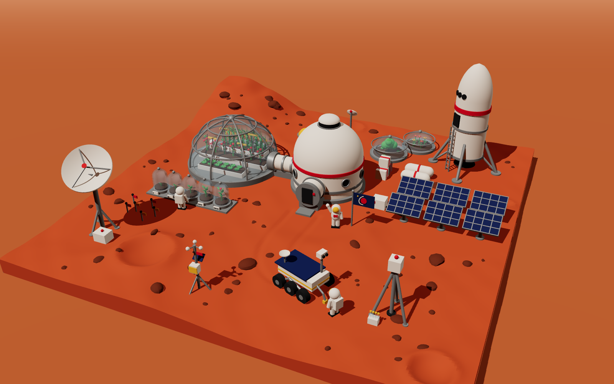
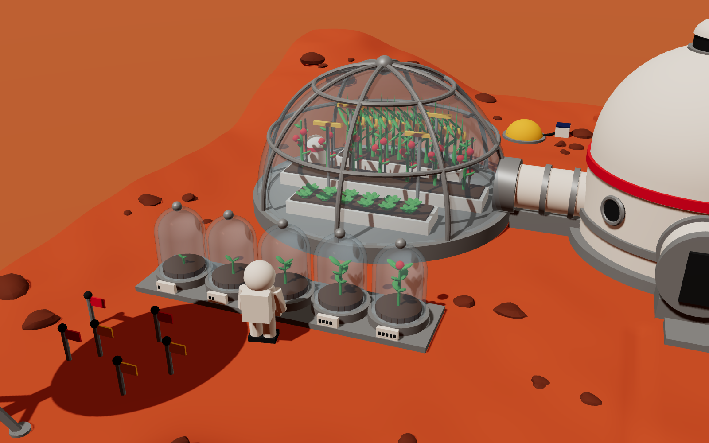
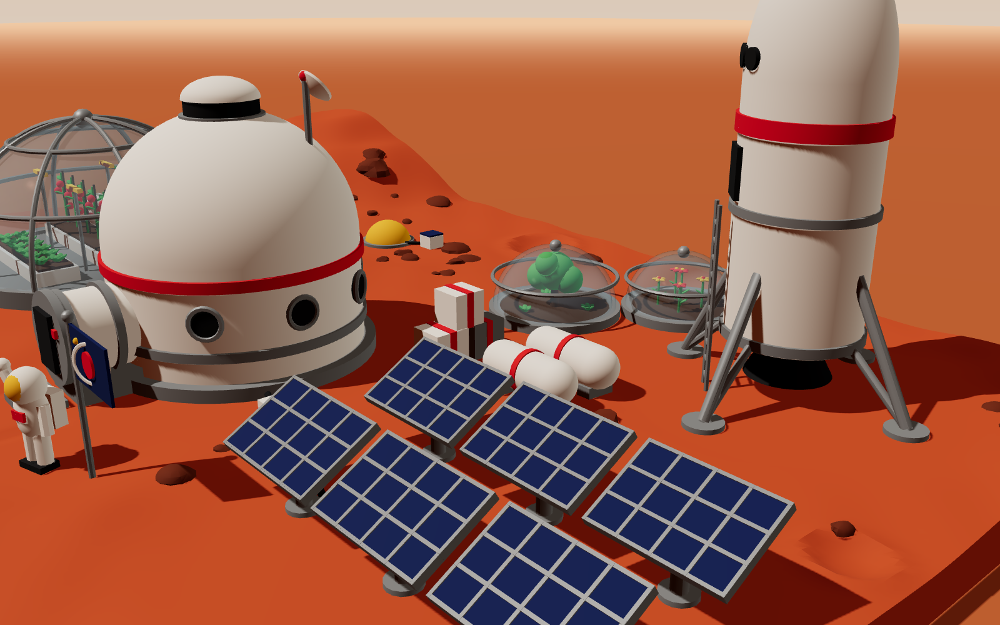
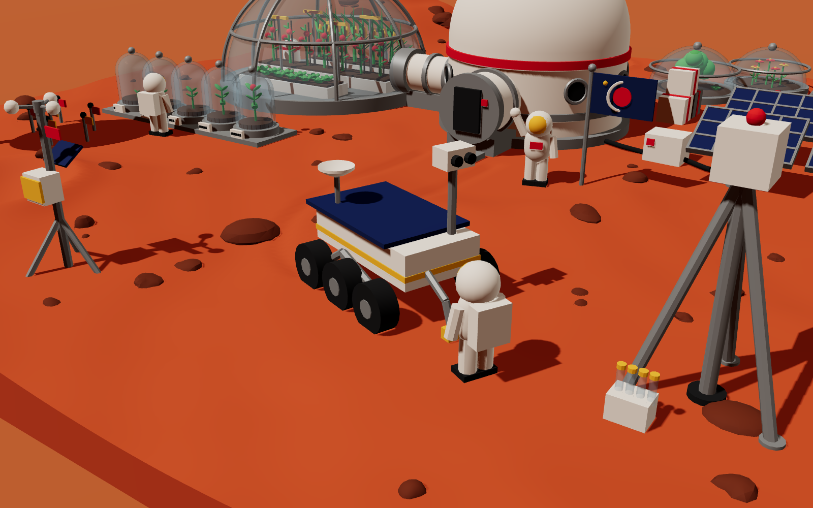

# First Footsteps: Mars Base 1

A Tinkercad scene of the **first crew to ever land on Mars**. This isn't a finished city. It's day one of the colony: a habitat, a glass greenhouse, seedlings growing in glass test jars, science probes poking at the dirt, and the rocket that brought everyone here.





## What's in the scene

| Thing | Details |
|---|---|
| **Main habitat** | Domed home with porthole windows, a skylight, a roof antenna with a red beacon, and an airlock with a door |
| **Glass greenhouse** | Big see-through dome with a metal frame. Inside: lettuce, tomato plants with red tomatoes, corn with gold cobs, a water tank, and grow lights |
| **Plant growth experiment** | 5 glass bell jars on a tray showing seedlings from day 1 to day 5. The last one is flowering, and the dots on each tag mark the day |
| **Mini glass domes** | One has a tiny fruit tree, the other has flowers |
| **Tunnel** | Connects the habitat to the greenhouse so nobody has to suit up to water the plants |
| **Rocket lander** | The ship they came in, with landing legs, a ladder, a hatch, and windows |
| **Solar farm** | 6 tilted panels, a battery box, and a cable to the habitat |
| **Test probes** | A drill rig with soil-sample tubes, a weather station, a seismometer dome, 6 soil-test stakes with flags, and a big comms dish |
| **Rover** | 6 wheels, a camera mast, a robot arm, and **tire tracks** pressed into the ground from the airlock |
| **Crew** | 3 astronauts: one waving next to the flag, one checking the seedlings, one heading to the rover |
| **Mars itself** | Dunes, craters, a hill, and about 80 rocks |

Size: **180 × 180 × 59 mm**, which fits on Tinkercad's default 200 × 200 workplane.

---

## Put it in Tinkercad

Download the files from the [`tinkercad/`](tinkercad) folder. There are three ways to do this.

### Let Claude do all the clicking
Tinkercad only runs inside your own logged-in browser, so this has to happen on your computer. Open the **Claude desktop app**, turn on **computer use** (or **Claude in Chrome**), and paste this:

> Open tinkercad.com in my browser (I'm already logged in) and create a new 3D design called "Mars Base 1". Download https://github.com/dippy34/ClashRoyale/raw/ccr-6934be4b-kmfr2g/tinkercad/mars_colony_parts.zip and unzip it. Import all 11 STL files into that design one at a time, in mm at 100% scale. Then colour each shape using the table in https://github.com/dippy34/ClashRoyale/blob/ccr-6934be4b-kmfr2g/README.md, and tick Transparent for 05_glass. If the parts don't line up, select all and use Align (bottom on the up/down axis, middle on the other two). Don't group them. Save, then send me a screenshot.

### Option A: one file, done in 1 minute
1. Go to [tinkercad.com](https://www.tinkercad.com), then **Create → 3D Design**.
2. Click **Import** (top right), choose **`tinkercad/mars_colony_full.stl`**, and keep the units on **mm**.
3. It comes in as one shape with one colour. Painting it orange-red makes it read as Mars.

### Option B (recommended): full colour with see-through glass
The scene is split into **11 files, one per colour**. They're built to line up with each other automatically.

1. Download **`tinkercad/mars_colony_parts.zip`** and unzip it, or grab the `.stl` files from [`tinkercad/parts/`](tinkercad/parts).
2. In a new Tinkercad design, **Import** each file one at a time (`01_terrain.stl` through `11_dark.stl`).
3. Click each imported shape, then click the **colour box** in the Shape panel and pick its colour from the table below.
4. For **`05_glass`**, tick **Transparent** in the colour picker. Now you can see the plants growing inside the domes and jars 🌱
5. If anything looks shifted: press **Ctrl+A** to select everything, press **L** for the Align tool, then click the **bottom** dot on the up/down axis and the **middle** dots on the other two. Everything snaps into place.

| File | Colour to pick |
|---|---|
| `01_terrain.stl` | orange-red (Mars ground) |
| `02_rocks.stl` | dark red-brown |
| `03_white.stl` | white (habitat, rocket, suits) |
| `04_metal.stl` | light grey |
| `05_glass.stl` | **Transparent** (light blue looks nice) |
| `06_plants.stl` | green |
| `07_soil.stl` | dark brown |
| `08_navy.stl` | dark blue (solar panels, flag) |
| `09_red.stl` | red (tomatoes, stripes, lights) |
| `10_gold.stl` | yellow / gold (visors, foil, corn) |
| `11_dark.stl` | black (windows, wheels, doors) |

> Tip: if you **Group** (Ctrl+G) everything, Tinkercad paints it all one colour unless you turn on **Multicolor** in the Shape panel. You can also just leave the shapes ungrouped.

Want to check it in another app first (Windows 3D Viewer, Blender, a slicer)? `tinkercad/mars_colony_colored.obj` + `.mtl` is the full-colour version in one file.

---

## Building it by hand with Tinkercad shapes

If your assignment says you have to build it yourself from basic shapes, this is how each piece is made:

| Piece | Tinkercad shapes |
|---|---|
| Ground | **Box** 180 × 180 × 6. Craters are **Half Spheres** set to *Hole*, sunk into the ground, with a thin **Torus** for the rim |
| Habitat | **Cylinder** Ø32 × 14 tall + **Half Sphere** Ø32 on top. Bands are thin **Tubes**, windows are small dark **Cylinders** turned sideways |
| Glass dome | **Half Sphere** Ø44, coloured *Transparent*. To make it hollow: duplicate it (Ctrl+D), shrink the copy by 1.6 mm, set it to **Hole**, then group the two |
| Test jars | **Cylinder** Ø7 × 6 + **Half Sphere** Ø7 on top, hollowed the same way. A tiny **Sphere** on top is the knob |
| Plants | Stems are thin **Cylinders**, leaves are squashed **Spheres** tilted up, tomatoes are small red **Spheres**, corn is a tall thin **Cone** |
| Rocket | **Cylinder** Ø16 × 30 + **Paraboloid** nose, dark **Cone** upside down for the engine, thin angled **Cylinders** for legs |
| Solar panel | Dark blue **Box** 14 × 9 × 0.7 tilted 30° on a **Cylinder** post. Thin grey **Boxes** make the grid lines |
| Comms dish | **Paraboloid** hollowed out on a **Cylinder** mast with three angled legs |
| Astronaut | 2 **Cylinder** legs, a **Box** backpack, a **Sphere** helmet with a slightly smaller yellow **Sphere** pushed forward for the visor |

---

## Look around in 3D / change the design

- **3D preview:** run `python3 -m http.server` in this folder, then open <http://localhost:8000/preview/viewer.html>. Drag to spin, scroll to zoom. You can add `?view=greenhouse`, `?view=lander`, `?view=rover` or `?view=top` to the address.
- **Change things** (more plants, a bigger dome, another astronaut): edit `generator/build_mars_colony.py`, then run
  ```
  pip install numpy
  python3 generator/build_mars_colony.py
  ```
  That rebuilds every file in `tinkercad/`. All the positions are listed near the top of the script, under **Layout**.

| More views | |
|---|---|
|  |  |
